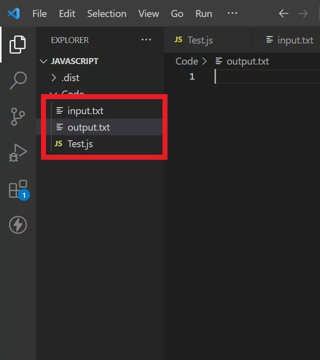
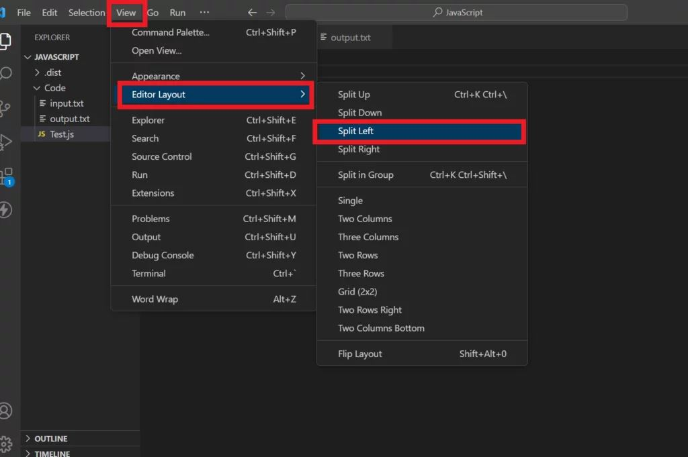
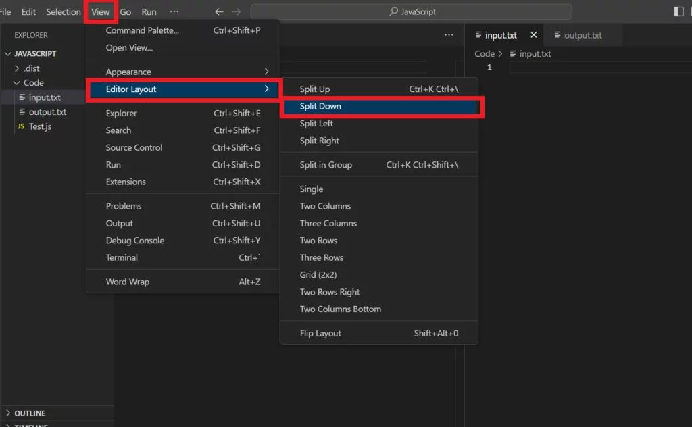
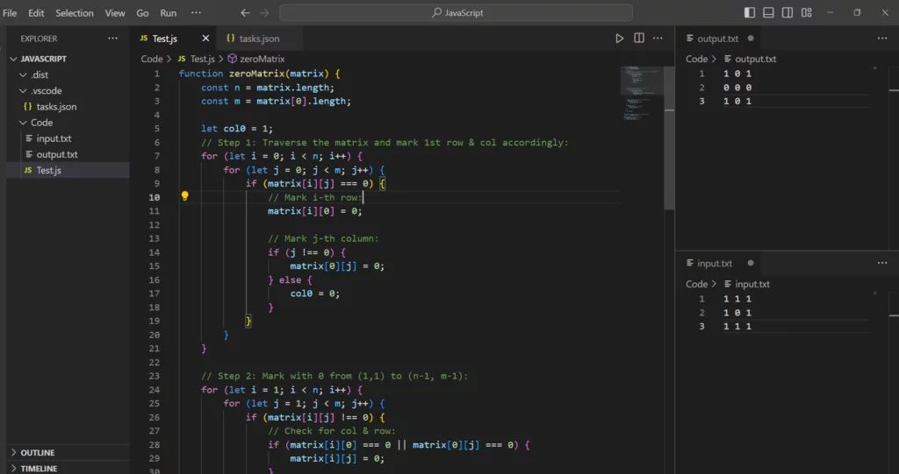
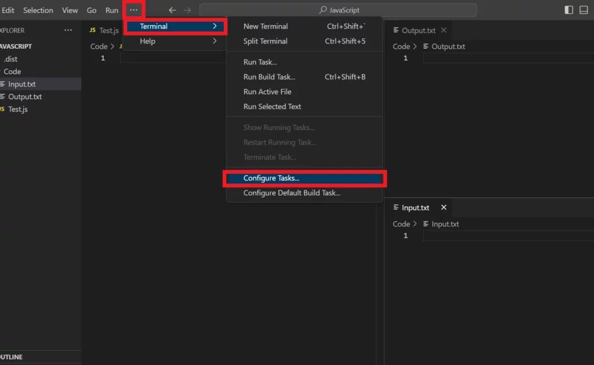
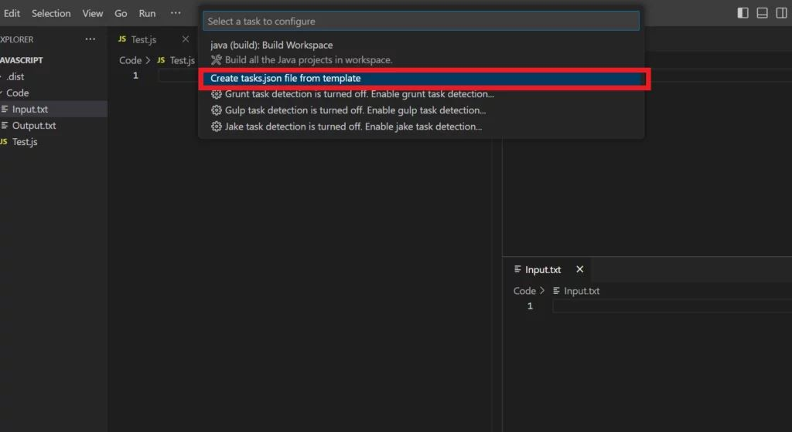
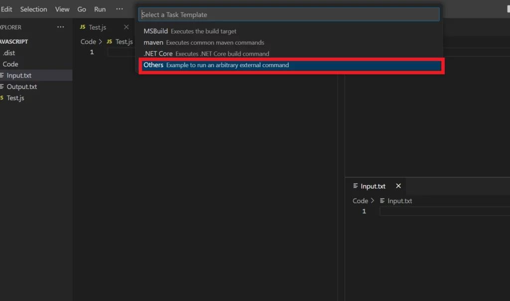
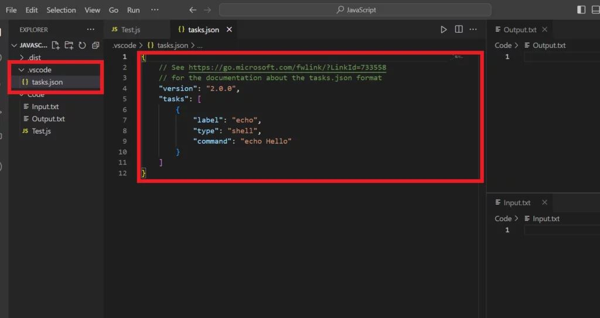

# :hammer_and_wrench: Setup for DSA and CP in Visual Studio Code:

## :desktop_computer: Open Visual Studio Code in your PC/Laptop Now Create JavaScript file in Code folder

### Creating File in Code Folder as Follows 

```JavaScript
demo.js
```

```
input.txt
```

```
output.txt
```

### Setting Up tasks.json File

Step 1 - Go to Terminal Click on Configure Tasks 

Step 2 - Select Create a tasks.json file from template and then Click on Others 

Step 3 - Copy the Code given below and Paste it into tasks.json 

```

{
  "version": "2.0.0",
  "tasks": [
    {
      "label": "Run JavaScript with Input/Output",
      "type": "shell",
      "command": "node",
      "args": ["${file}", "<", "input.txt", ">", "output.txt"],
      "presentation": {
        "reveal": "never"
      },
      "group": {
        "kind": "build",
        "isDefault": true
      },
      "options": {
        "cwd": "${workspaceFolder}"
      }
    }
  ]
}

```

# Now For Setting Up Layout go to the Steps given Below 

## Step 1 



## Step 2 



## Step 3 



## Step 4 



## Step 5 



## Step 6 



## Step 7 



## Step 8



:heart: Follow Me For More Projects [GitHub](https://github.com/ChinmayKaitade) | [LinkedIn](https://www.linkedin.com/in/chinmay-sharad-kaitade) | [Email](chinmaykaitade123@gmail.com)